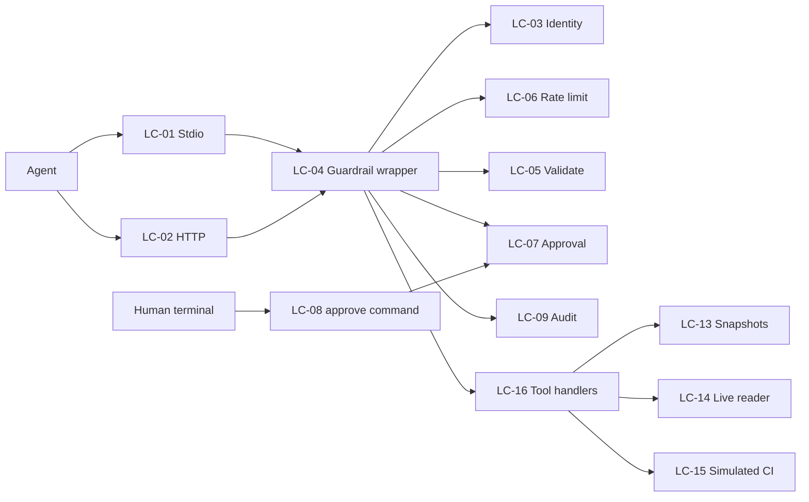

# Logical Components

Scope: the whole server (one deployable: a single local Node.js process plus a small `approve` command). Source tags: `[Qn]` = answer in `nfr-design-questions.md` (design) or `[NQn]` = `../nfr-requirements/nfr-requirements-questions.md`; `[NFRx.y]` = requirement in `../nfr-requirements/`. The platform engineer's cloud material does not apply: there is no network topology, hosting, account, or environment to design. Deployment is "clone, `npm ci`, run" [TP].

## Component inventory

| ID | Component | Responsibility | Failure domain |
|----|-----------|----------------|----------------|
| LC-01 | StdioTransport | MCP protocol over standard input/output (local process mode); standard output carries protocol only | The process |
| LC-02 | HttpListener | Optional HTTP mode: loopback bind, Host/Origin checks, bearer-token auth, serialised failed-login queue, body size cap, 50-connection bound | Connection |
| LC-03 | ClientIdentity | Resolves the calling client: random session ID (stdio) or token name (HTTP) | Request |
| LC-04 | GuardrailWrapper | The single path every tool goes through: identify, rate limit, validate, approve, audit, execute, audit, error mapping | Request |
| LC-05 | InputValidator | One strict schema per tool (zod); repository-reference and size rules | Request |
| LC-06 | RateLimiter | Fixed 60 s window per client: 30 reads, 3 writes | Client |
| LC-07 | ApprovalService | In-memory request, approve, verify, consume; 5-minute validity; bound to tool, client, input digest | Client |
| LC-08 | AdminChannel + `approve` command | Per-process Unix socket in a 0700 per-user directory, and a separate command a human runs in a terminal to list and confirm pending approvals; not an MCP tool, not an HTTP route | Process |
| LC-09 | AuditWriter | Append-only JSON-lines file, single-writer queue, lock file, 100 MiB cap, fsync on write intent | Process (file) |
| LC-10 | Redactor | Removes secret-like keys and values from audit records and log lines | Pure function |
| LC-11 | Logger | Structured JSON lines to standard error, levels, correlation by call ID | Process |
| LC-12 | Ports | Injected `Clock`, `IdSource`, `Rng`, `Net` (fetch), `Scheduler` so tests are deterministic and offline | Pure |
| LC-13 | SnapshotStore | Reads bundled snapshots on demand; 5 MiB document cap; small bounded cache | Process |
| LC-14 | LiveGitHubReader | Optional, off by default; unauthenticated; two-host allow-list; timeout, retries, deadline | Optional dependency |
| LC-15 | SimulatedCI | In-project stand-in for a CI system; the only state a write can change | Process |
| LC-16 | Tool handlers | Upgrade planner, CI triage (read-only), re-run failed job (write) | Request |
| LC-17 | Config | Reads environment variables only (tokens, paths, log level, live-mode switch) | Startup |
| LC-18 | Lifecycle | Startup checks (token count, lock), SIGINT/SIGTERM drain, cleanup of lock and socket | Process |

## Relationships

Text fallback: the agent reaches LC-01 or LC-02; both hand every call to LC-04, which uses LC-03, LC-06, LC-05, LC-07 and LC-09 in a fixed order and then calls a LC-16 handler; handlers read LC-13 (and optionally LC-14) and, for the one write, change LC-15. A human uses the `approve` command (LC-08), which reaches LC-07 only through the per-user socket.

## Blast radius

- A bug in one tool handler is contained by the wrapper's error boundary: one error audit record, a defined error, the server keeps serving (NFR1.14).
- Loss of the audit file (unwritable, full, or locked) disables writes and degrades reads to "result plus reported failure" (NFR1.5, NFR1.12, NFR1.18).
- The only external effect any component can have is a change inside LC-15 (simulated CI); no component writes to real GitHub or any real CI service [FR4.1].
- A compromised same-user process is out of scope (accepted risk, see `security-design.md`).

## Shared resources

- One audit file and one lock file (LC-09); one admin socket (LC-08); the in-memory maps of LC-06 and LC-07. All are process-local and bounded (`scalability-design.md`).

## Test seams and quality gates (design for NFR3-NFR6, NFR8.7-8.8)

- Every component takes its collaborators and the LC-12 ports through constructor arguments; no module reads the real clock, randomness, or network directly. This is what makes the injected-clock, offline, repeatable tests possible (NFR5.1-NFR5.3).
- Coverage: Vitest V8 coverage with a global 90% threshold and per-path thresholds of 100% lines and branches on LC-04, LC-06, LC-07, LC-08 and LC-09 (the wrapper, rate limiter, approval, admin channel and audit code; LC-08 is included because it carries the approval property). Exclusions are listed in the config with a reason (NFR3.1-NFR3.3).
- Tests are Given/When/Then and live beside the code they cover (NFR4.1). A registry test enumerates all registered tools and fails if one is unwrapped, or a state-changing tool is reachable without approval, or an approval-issuing tool exists (NFR4.3, NFR1.3).
- A global test guard throws on any socket creation, so a stray network call fails the suite (NFR5.1). Benchmarks live in `npm run bench`, outside the unit suite.
- Toolchain: strict TypeScript, Prettier, ESLint, a separate `tsc --noEmit` job; all are required checks on pull requests (NFR6.1-NFR6.5). Node version is pinned in `.nvmrc` and `engines`, and CI reads the same pin (NFR8.8). The README carries the exact setup, test and walkthrough commands (NFR8.7).

## Requirement clarifications decided at design

These refine requirement wording and need your attention at the gate, because the requirement documents are already approved:

- Audit counting (NFR4.2, NFR1.10, NFR1.14): "one record per call" means one call ID. A write has two lines sharing the ID; every other call has one line [Q2].
- Client (NFR1.9, NFR1.19): a client is a token. The "sixth client" cannot connect because at most 5 tokens can be configured (startup refuses more) [Q5].
- Failed-login throttle (NFR1.16): the requirement's "5 failures in a minute, then refuse for a minute" is replaced by a design that cannot lock out legitimate clients: a valid token is never delayed; failed attempts go through one serialised queue costing 200 ms each, at most 20 waiting, extras closed. The NFR1.16 test text ("the 6th failure within a minute is refused without a token comparison") would change to "failed attempts are processed at most about 5 per second, a valid token still succeeds during an attack, and a 21st queued failure is closed immediately". This is a proposed change to approved wording and needs your agreement at the gate.
- Approval (NFR1.3): there is no approval code. The human lists and confirms pending requests with the `approve` command in a terminal, so standard error never carries a secret [Q1 A, refined]. The 5 minutes run from the moment the human approves; a request nobody approves expires 5 minutes after it was made [assumption].
- Control characters (NFR1.1): the validator rejects control characters in every string argument, so the approval display cannot be spoofed.
- Same-user shell access by a malicious agent is out of scope for NFR1.3(a); see the trust model in `security-design.md`.
- Live reading (NFR1.6): raw CI log downloads are not available in live mode; logs come from snapshots [Q6].

## Sources

- [Q1]-[Q7]; [NFR1.x]-[NFR8.x]; tech stack in `../nfr-requirements/tech-stack-decisions.md`; `team.md` and `project.md` practices.

## Assumptions & Open Questions

- [assumption] The admin socket and `approve` command target macOS and Linux (Unix domain sockets); Windows named pipes are out of scope for the first version.
- [assumption] Maximum 50 simultaneous HTTP connections, as a socket bound; not user-confirmed.
- Open: exact file and module layout is a Code Generation decision.
